<div align="center">
  <a href="https://kubernetes.io/es/">
    
  </a>
</div>
<div align="center">
  <h1>Simple Development Environment</h1>
  <strong>Construye tu ambiente de desarrollo de una manera facil</strong>
</div>
<br>
<p align="center">
    
</p>

      

El objetivo de este repositorio es poder crear maquinas virtuales y aprovisionarlas con herramientas como docker, CRI-O y K8S para facilitar la creaci'on de un ambiente de desarrollo con las heramientas necesarias!

## Instalacion

El siguiente comando es valido para ArchLinux y derivadas:

> valida la forma de instalarlo en tu distribucion de preferencia

```bash
sudo pacman -S vagrant \
               ansible  \
               virtualbox \
               virtualbox-host-modules-arch \ 
               linux-headers
```

```bash
git clone https://github.com/wortiz1027/vagrant.git && cd vagrant
```

## Creacion y Aprovisionamiento

vagran es la raiz del proyecto y dentro existen 2 directorios para crear y aprovisionar maquinas para docker y k8s, debes escoger que clase de maquina quieres crear/aprovisionar y ejecutar el siguiente comando:

```bash
vagrant up
```

## Configuracion

1. Ambiente Docker

```bash
cd vm_docker
```

Una vez creada la maquina y aprovisionada si lo que deseas es acceder desde la maquina host ejecuta en la maquina virtual el siguiente comando:

```bash
sudo dockerd -H unix:///var/run/docker.sock -H tcp://<remote-ip-address> &
```

esto para exponer el socket del deamon de docker de la VM remota. y en la maquina host solo tienes que descrgar el [cliente docker](https://docker-docs.uclv.cu/engine/install/binaries/) e instalarlo y puedes ejecutar docker hacia la VM remota:

```bash
docker DOCKER_HOST=tcp://<yout-vm-ip-address>:<vm-docker-port> ps -a
```

pero si no quieres tener que tipear la variable **DOCKER_HOST** cada que ejecutas un comando de docker puedes exportarla:

```bash
export DOCKER_HOST=tcp://<yout-vm-ip-address>:<vm-docker-port>
```
1.1 Development Environment

La idea de aprovisionar una maquina con docker es poder tener un ambiente listo para desarrollar. En el archivo docker-compose.yaml agrego un listado de servicios/aplicaciones implesindibles, entre las que destaco:
| Component   |      Image      |  Version |
|----------|:-------------:|------:|
| docker-socket-proxy | tecnativa/docker-socket-proxy | latest |
| watchtower | containrrr/watchtower | latest |
| dozzle | amir20/dozzle | latest |
| traefik | traefik | v3.0.0-beta5 |
| portainer | portainer/portainer-ce | latest |
| whoami | containous/whoami | latest |
| postgres | postgres | latest |
| mysql | mysq | latest |
| mongo | mong | latest |
| redis | redis | latest |
| pgadmin | dpage/pgadmin4 | latest |
| mongo-express |  mongo-express | latest |
| payara | payara/server-full | latest |
| keycloak | quay.io/keycloak/keycloak | latest |
| jaeger | jaegertracing/all-in-one | latest |
| otel | otel/opentelemetry-collector-contrib | latest |
| prometheus | prom/prometheus | latest |
...

en el archivo boostrap.sh se crean un conjunto de certificados para aprovechar las capacidades de traefik y que nuestro ambiente esté bajo un entorno seguro, para esto se hacer uso de [mkcert](https://github.com/FiloSottile/mkcert) para simular una CA Authority y al momento de navegar desde el navegador por las aplicaciones no tener la alerta de sitio no seguro, para ello una vez creada y aprovisionada la maquina ejecutamos los siguientes pasos desde la maquina host:

```bash
scp -r vagrant@192.168.56.10:/home/vagrant/.local/share/mkcert ~/.local/share/
```

> **password**: vagrant

esto con el objetivo de copiar los certificados del **CAROOT** de la vm en nuestra maquina host, las imagenes a continuacion describen el proceso:

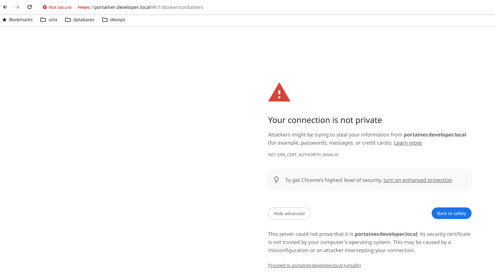
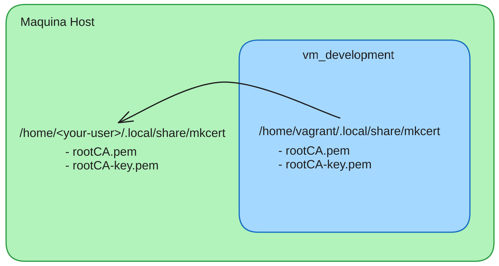
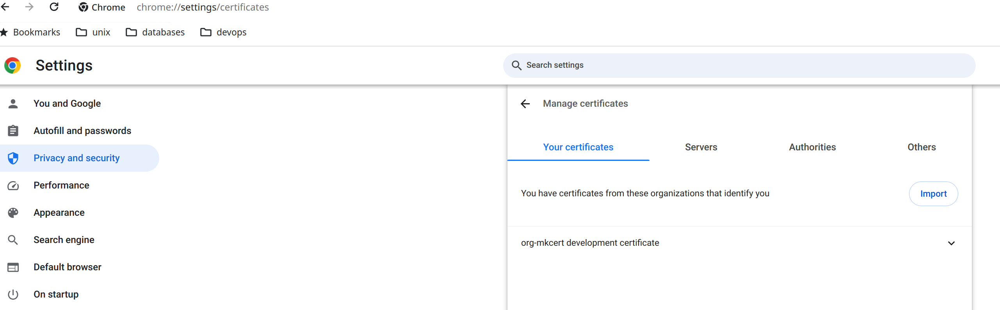
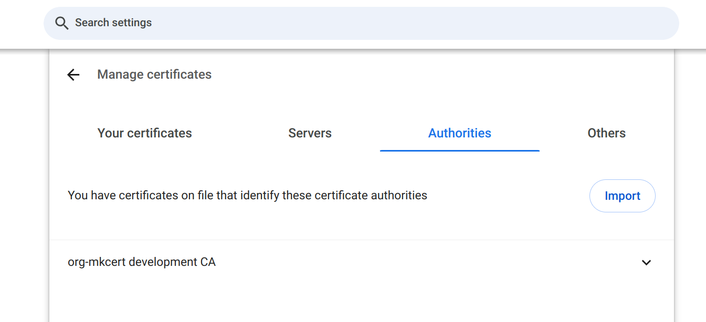
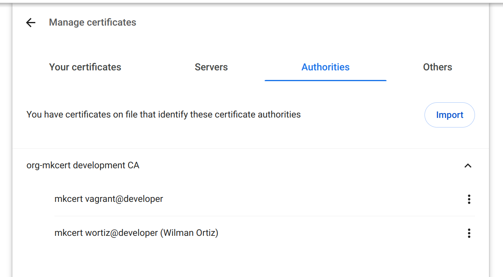
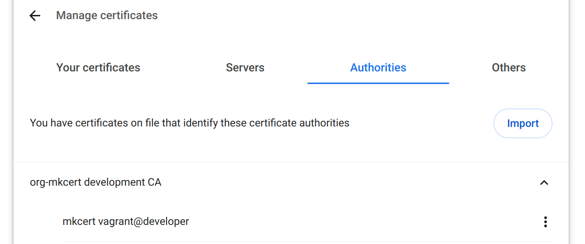
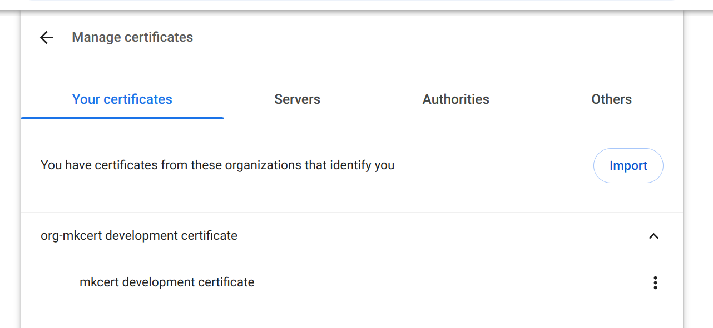
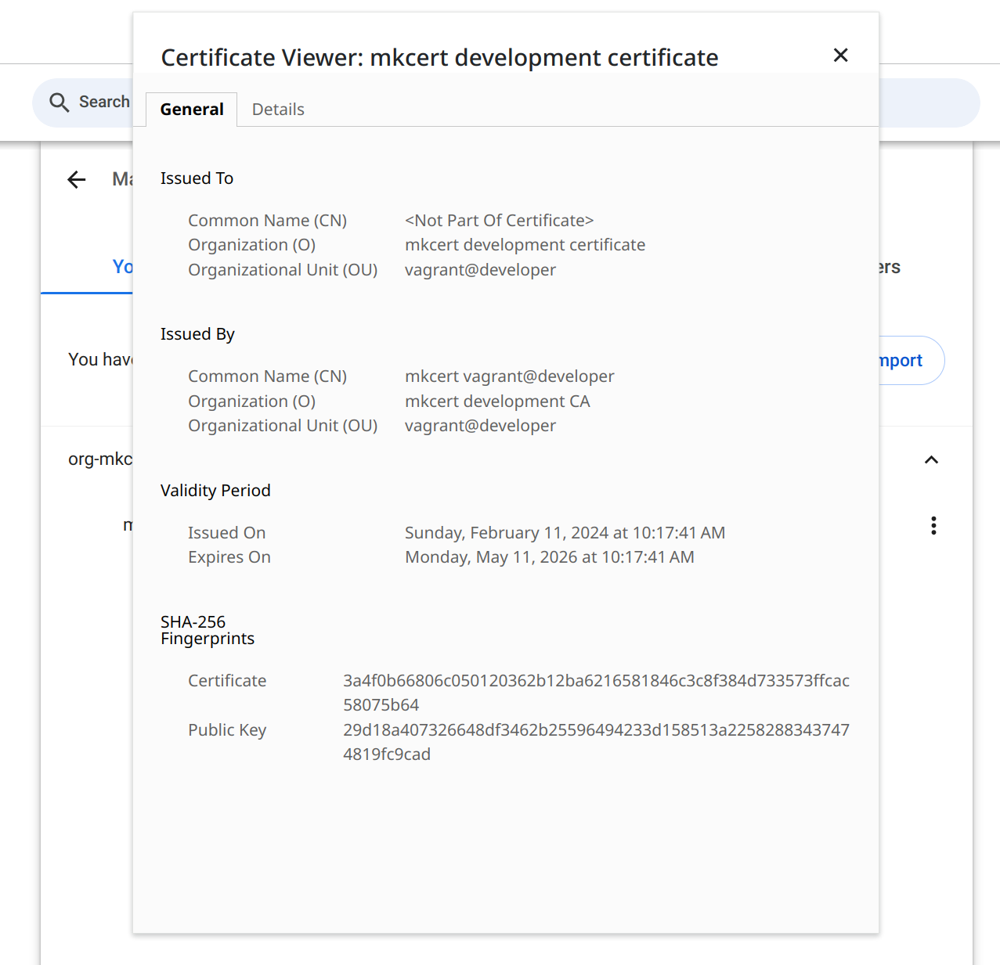
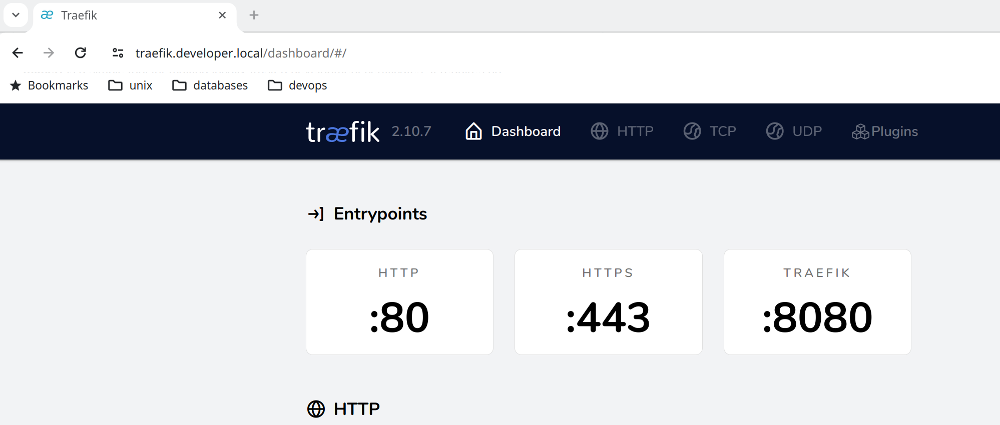
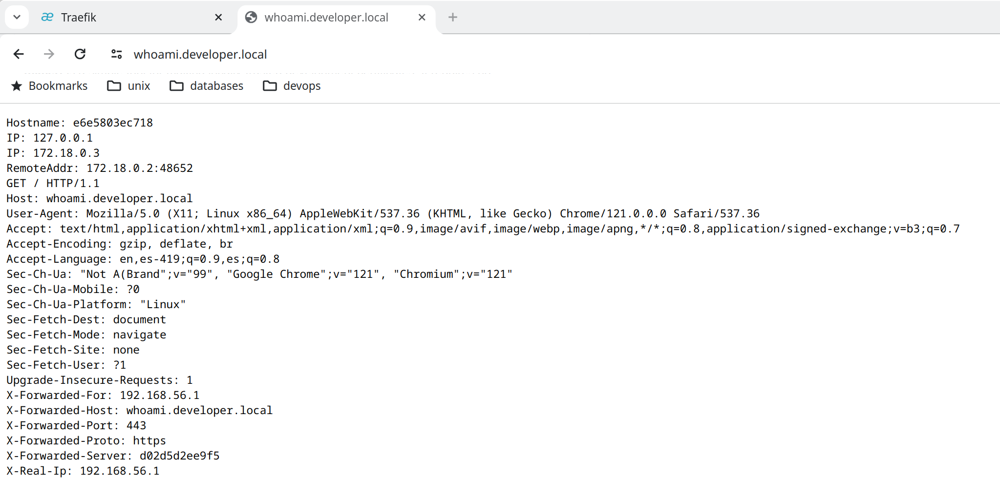
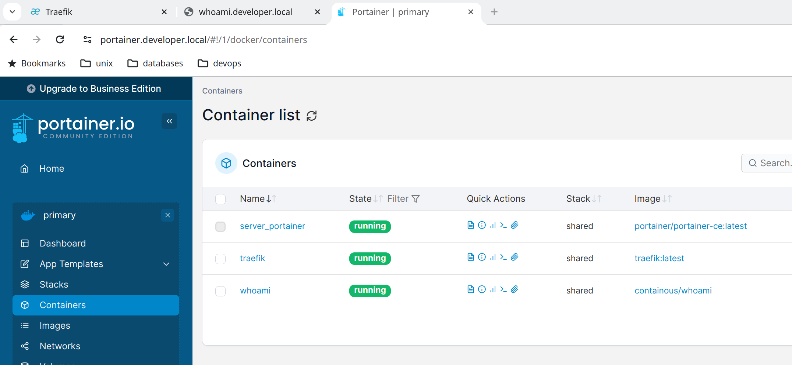
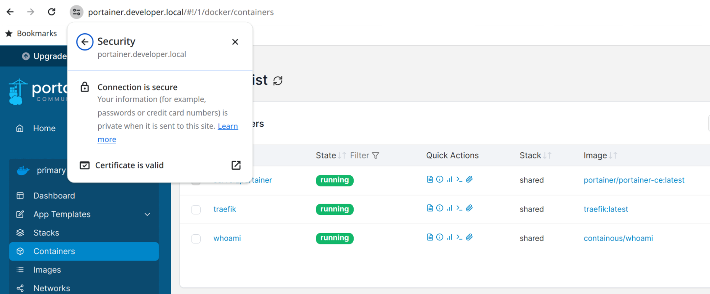

2. Ambiente K8S

Una vez creado y aprovisionado el cluster lo siguiente es instalar **KUBECTL** en la maquina host, se pueden usar diferentes mecanismos, por mi parte use **ASDF**:

```bash
asdf plugin-add kubectl https://github.com/asdf-community/asdf-kubectl.git
```

```bash
asdf install kubectl <your-specific-version>
```

moverse hace el directorio **$HOME**

```bash
cd ~ 
cd $HOME
```

y ejecutar el siguiente comando:

```bash
scp -r vagrant@<k8s-master-node-ip-address>:/home/vagrant/.kube ~
```

Permisos solo para el usuario anfitrion sobre ~/.kube/config

```bash
chmod o-r ~/.kube/config
chmod g-r ~/.kube/config
```

los datos de autenticacion son:

> **username**: vagrant
> **password**: vagrant

## Recursos
### Config Kubectl
- [Configure kubectl](https://medium.com/@rajkumar.rajaratnam/configure-local-kubectl-to-access-remote-kubernetes-cluster-ee78feff2d6d)

### Install and config k8s in arch
- [Configure k8s on arch linux](https://dnaeon.github.io/install-and-configure-k8s-on-arch-linux/)

### k8s and cri-o
- [Configure K8S with CRI-O](https://kubevirt.io/2019/KubeVirt_k8s_crio_from_scratch.html)

### Ansible and CRI-O example
- [Ansible - K8S - CRI-O example 1](https://github.com/jouros/Crio-cri-Ansible/blob/main/master-playbook-2.yml)
- [Ansible - K8S - CRI-O example 2](https://github.com/ssorato/ansible-k8s-cri-o/blob/master/main.yml)
- [Ansible - K8S - CRI-O example 3](https://github.com/cri-o/cri-o-ansible/blob/master/cri-o.yml)
- [Ansible - K8S - CRI-O example 4](https://github.com/cri-o/cri-o-ansible)

### CRI-O For k8s
- [CRI-O Container Runtime](https://medium.com/nerd-for-tech/using-cri-o-as-container-runtime-for-kubernetes-b8ddf8326d38)

### Install CRI-O on Ubuntu
- [Install CRI-O Runtime container](https://www.linuxbuzz.com/install-crio-container-runtime-on-ubuntu/)

### KubeAdm with CRI-O
- [Kubeadm - CRI-O 1](https://projectatomic.io/blog/2017/06/using-kubeadm-with-cri-o/)
- [Kubeadm - CRI-O 2](https://earthly.dev/blog/deploy-kubernetes-cri-o-container-runtime/)

### K8s with kubeadm
- [Kubeadm install k8s cluster](https://admantium.medium.com/kubernetes-with-kubeadm-cluster-installation-from-scratch-810adc1b0a64)

### K8s with vagrant
- [K8S - Vagrant 1](https://kubernetes.io/blog/2019/03/15/kubernetes-setup-using-ansible-and-vagrant/)
- [K8S - Vagrant 2](https://github.com/lvthillo/vagrant-ansible-kubernetes/blob/master/Vagrantfile)
- [K8S - Vagrant 3](https://github.com/patrickdlee/vagrant-examples/blob/master/example6/Vagrantfile)

### K8s with Ansible
- [K8S - Ansible 1](https://medium.com/@venkataramarao.n/kubernetes-setup-using-ansible-script-8dd6607745f6)
- [K8S - Ansible 2](https://www.checkmateq.com/blog/ansible-kubernetes)

